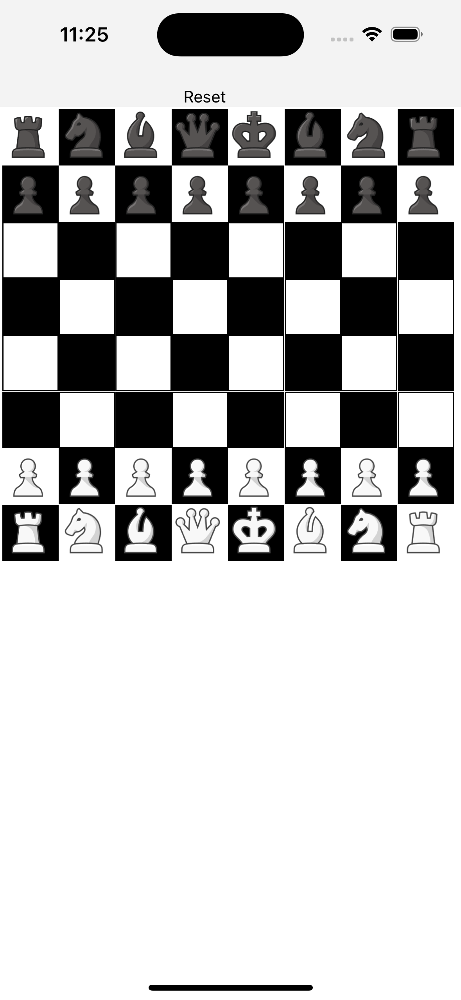

<div align="center" markdown="1">

# [react-native-chess-board](https://react-chessboard.vercel.app/)



# What is react-native-chess-board?
react-native-chess-board is a react native based implementation of https://www.npmjs.com/package/react-chessboard

## Installation

```bash
# using npm (will need to register a package name with npm)
npm i react-native-chess-board

# OR using Yarn
yarn add react-native-chess-board
```